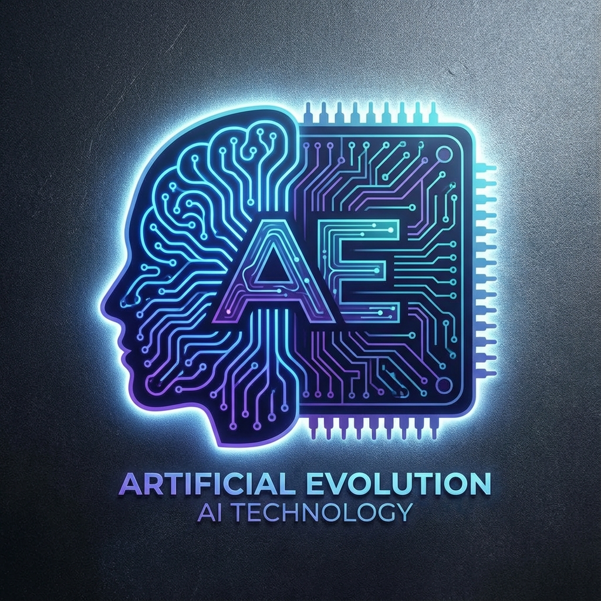

# 🎯 REGULI BUTOANE - IMPLEMENTARE DIMINEAȚĂ (2025-12-17)

**Status:** ✅ TOATE ACTIVE ȘI FUNCȚIONALE
**Verificat:** 2025-12-17 19:34 UTC
**Commit:** f5a5d82 (12:35) + 0f6ee8d (19:30)

---

## 📋 REGULI GENERALE

### 1. **Buton AE Central (Hero Section)**
- **Locație:** `index.html` - Centru pagină principală
- **Funcție:** Link direct către `promo_video.html`
- **Design:** Logo AE cu animație PULSE (cercuri radar portocalii)
- **Scop:** Viralizare TikTok
- **Cod:**
  ```html
  <a href="promo_video.html" class="ae-hero-btn" title="Watch Promo & Share">
    <div class="ae-pulse"></div>
    
  </a>
  ```
- **REGULĂ CRITICĂ:** NU duce la Dashboard! Doar la Video Promo!

---

### 2. **Buton "My Hub" (Acces Dashboard/Admin)**
- **Locație:** Header navigation (toate paginile)
- **Funcție:** Link către `dashboard.html`
- **Design:** Logo AE mic (30x30px) + text "My Hub"
- **Scop:** Acces la Dashboard pentru membri și admin
- **Cod:**
  ```html
  <a href="dashboard.html" class="nav-btn">
    <span class="nav-icon">
      
    </span>
    <span class="nav-text" data-i18n="nav_myhub">My Hub</span>
  </a>
  ```

---

### 3. **Butoane "Back" în Galerii**
- **Locație:** `gallery-drawings.html`, `gallery-games.html`, `gallery-stories.html`
- **Funcție:** Întoarcere la `index.html` (Homepage)
- **Design:** Buton alb translucid cu border
- **Text:** "⬅️ Back" (tradus în toate limbile)
- **Cod:**
  ```html
  <a href="index.html" class="btn-back-dash" data-i18n="btn_back">⬅️ Back</a>
  ```
- **REGULĂ:** NU mai scrie "Dashboard"! Scrie "Back"!

---

## 🎨 REGULI SPECIFICE GALERIE COLORING

### 4. **Butoane pentru Produse FREE**
- **Vizibilitate:** Vizibile pentru TOȚI utilizatorii (logați sau nu)
- **Click Action:** Deschide Paint Pro (overlay full-screen)
- **Funcție:** `openPainter('img_path', 'title')`
- **Cod:**
  ```javascript
  onclick="openPainter('${item.img}', '${item.title}')"
  ```

### 5. **Butoane pentru Produse PREMIUM**
- **Vizibilitate:** Vizibile DOAR pentru ADMIN
- **Regula de afișare:**
  ```javascript
  if (item.premium && !isAdmin) {
    return; // NU se renderizează deloc!
  }
  ```
- **Click Action:** Alert placeholder pentru Premium Studio
- **Cod:**
  ```javascript
  onclick="alert('Premium Studio Loading for: ${item.title} (Requires Separate Module)')"
  ```
- **Label:** "🔒 [Title]" (lacăt pentru premium)

### 6. **Buton DELETE (🗑️)**
- **Locație:** Colț stânga-jos pe fiecare slot umplut
- **Vizibilitate:** Apare doar la HOVER pe slot
- **Funcție:** Șterge desenul (marchează ca "deleted" în localStorage)
- **Confirmare:** Mesaj de confirmare tradus în limba curentă
- **Cod:**
  ```html
  <button class="btn-delete" onclick="deleteDrawing(${item.id})">🗑️</button>
  ```
- **CSS:**
  ```css
  .btn-delete { display: none; }
  .slot.filled:hover .btn-delete { display: block; }
  ```

---

## 🎮 REGULI PAINT PRO (Overlay)

### 7. **Butoane Toolbar Paint**
- **Tools:** 🖌️ Brush, 🖍️ Marker, ✏️ Pencil, 🧽 Eraser, 🗑️ Clear, ↩️ Undo
- **Active State:** Butonul selectat are background albastru (#4C8BF5)
- **Funcții:**
  - `useTool('brush')` - Pensulă normală
  - `useTool('marker')` - Marker translucid
  - `useTool('pencil')` - Creion subțire (1px)
  - `useTool('eraser')` - Gumă
  - `clearCanvas()` - Șterge tot (cu confirmare)
  - `undoLast()` - Undo ultimul pas

### 8. **Butoane Quick Colors**
- **Culori:** 🔴 Red, 🔵 Blue, 🟢 Green, 🟡 Yellow, ⚫ Black, ⚪ White
- **Funcție:** `setQuickColor('red')`
- **Hover Effect:** Scale 1.2 + border alb

### 9. **Butoane Window Controls**
- **Print:** 🖨️ Print - `printDrawing()` - Deschide dialog print
- **Exit:** ❌ Exit - `closePainter()` - Închide overlay
- **Design:** Print = albastru, Exit = roșu

---

## 🎯 REGULI PREMIUM ACCESS

### 10. **Logica de Vizibilitate Premium**
```javascript
const isAdmin = localStorage.getItem('kdh_admin_mode') === 'true';

// REGULA: Dacă premium și NU admin → NU renderiza!
if (item.premium && !isAdmin) {
  return; // Produsul NU apare deloc în galerie
}
```

### 11. **Diferențiere Vizuală Premium**
- **Border:** Gold (auriu) în loc de portocaliu
- **Background:** #fff8e1 (tint auriu deschis)
- **Label:** "🔒 [Title]" cu lacăt
- **CSS Class:** `.premium-slot`

---

## 📱 REGULI RESPONSIVE

### 12. **Butoane pe Mobile**
- Toate butoanele au `touch-action: manipulation` implicit
- Hover effects se aplică și la touch
- Paint Pro funcționează cu touch events (touchstart, touchmove, touchend)

---

## 🌍 REGULI TRADUCERI

### 13. **Butoane Traduse**
Toate butoanele cu `data-i18n` sunt traduse automat:
- `btn_back` → "Back" / "Înapoi" / "Retour" / etc.
- `nav_myhub` → "My Hub" / "Centrul Meu" / etc.
- Confirmare delete → Tradusă în limba curentă

---

## ✅ CHECKLIST VERIFICARE

- [x] Buton AE Central → `promo_video.html` ✅
- [x] Buton "My Hub" → `dashboard.html` ✅
- [x] Butoane "Back" în galerii → `index.html` ✅
- [x] Produse FREE → Vizibile pentru toți ✅
- [x] Produse PREMIUM → Vizibile doar pentru admin ✅
- [x] Buton DELETE → Apare la hover ✅
- [x] Paint Pro Tools → Funcționale ✅
- [x] Quick Colors → Funcționale ✅
- [x] Print/Exit → Funcționale ✅
- [x] Traduceri → Active ✅

---

## 🔒 REGULI ÎNGHEȚATE (Modul Arhitect)

**ATENȚIE:** Aceste reguli sunt ÎNGHEȚATE conform `MOD_LUCRU_ARHITECT.md`!

NU se modifică decât în caz de forță majoră:
1. Butonul AE Central duce DOAR la Promo Video
2. Accesul Admin se face prin "My Hub"
3. Butoanele în galerii scriu "Back", NU "Dashboard"
4. Premium-ul este invizibil pentru non-admin

---

**Salvat:** 2025-12-17 19:35 UTC
**Autor:** Modul Arhitect
**Status:** DOCUMENTAȚIE OFICIALĂ
